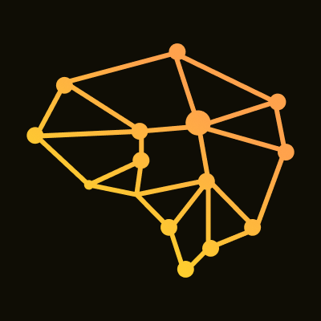
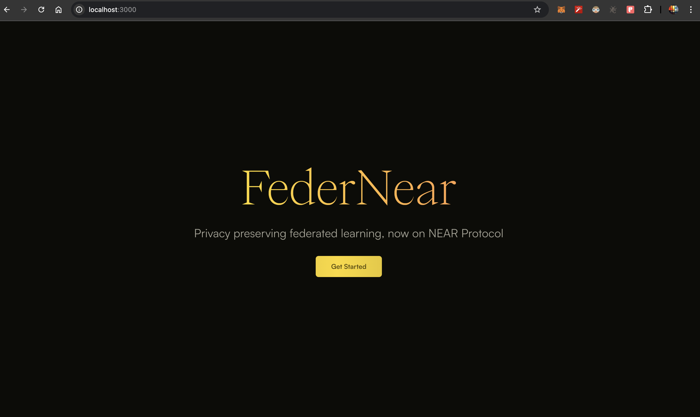
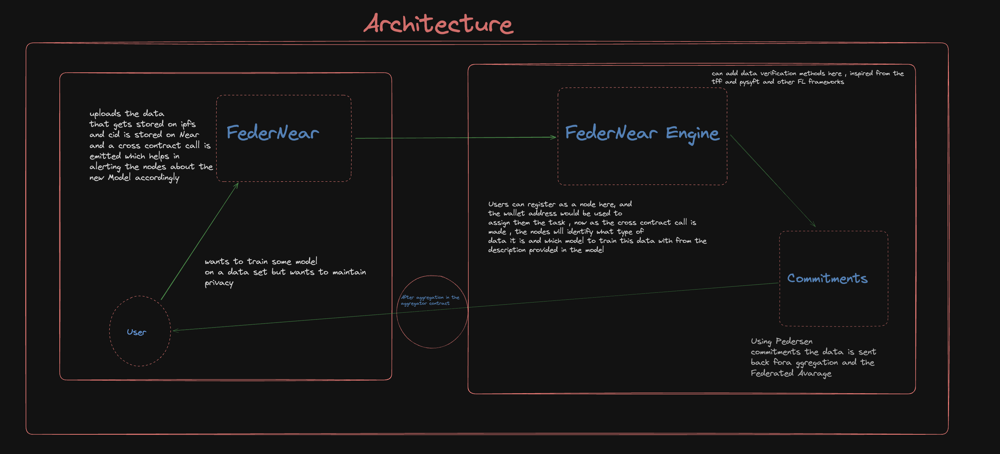

# FederNear: Privacy-Preserving Federated Learning Platform

</img>

Read our wonderful docs <a href="https://federnear.gitbook.io/federnear">Here</a>

FederNear is a decentralized platform built on the NEAR blockchain, enabling secure, privacy-preserving model training on distributed datasets. It ensures that sensitive data remains private by leveraging Pedersen commitments to keep model parameters (weights and biases) confidential during training.

NEAR blockchain enables decentralized coordination, allowing nodes to participate in the training process while supporting on-chain aggregation of encrypted data.

</img>

## Key Features

- **Blockchain Coordination (NEAR):**  
  The NEAR blockchain orchestrates the training process, emitting events, managing node registration, and facilitating on-chain aggregation of encrypted data.

- **Privacy-Preserving Model Training:**  
  Pedersen commitments enable nodes to train models locally on their datasets while keeping both the data and model parameters confidential. This ensures that sensitive information is protected throughout the training process.

- **Decentralized Node Participation:**  
  Users can register as nodes to participate in model training using their private datasets without revealing any data. This decentralized system supports collaborative learning without the need to share data.

- **Encrypted Aggregation:**  
  After training, nodes submit their encrypted weights and biases, which NEAR-based smart contracts then aggregate on-chain, ensuring privacy during the aggregation process.

</img>

## Architecture Overview

- **Server-Side (Model Provider):**
  - **Upload Model:**  
    The user (model provider) uploads a model (e.g., linear regression, neural network) and registers it on the NEAR blockchain.
  - **Event Emission:**  
    Once the model is registered, an event is emitted on the NEAR blockchain, notifying all registered nodes of the new model available for training.

- **Client-Side (Nodes):**
  - **Node Registration:**  
    Users can register their wallet address as nodes on the NEAR blockchain.
  - **Data Processing:**  
    Upon detecting a model registration event, a node retrieves the model parameters, loads its private dataset, and begins training.
  - **Pedersen Commitments:**  
    The trained model’s weights and biases are encrypted using Pedersen commitments to maintain confidentiality.
  - **Encrypted Submission:**  
    Nodes submit their encrypted weights and biases to the NEAR smart contract for aggregation.

- **On-Chain Aggregation:**  
  The NEAR smart contract aggregates encrypted results from multiple nodes without exposing any underlying data.

- **Decrypted Results:**  
  The model provider retrieves the final encrypted aggregated model and decrypts the weights using their private key.

